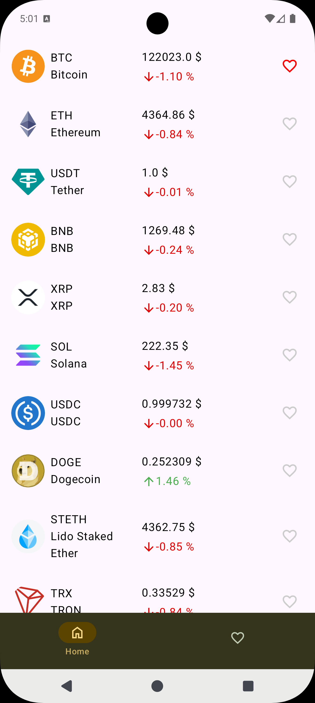
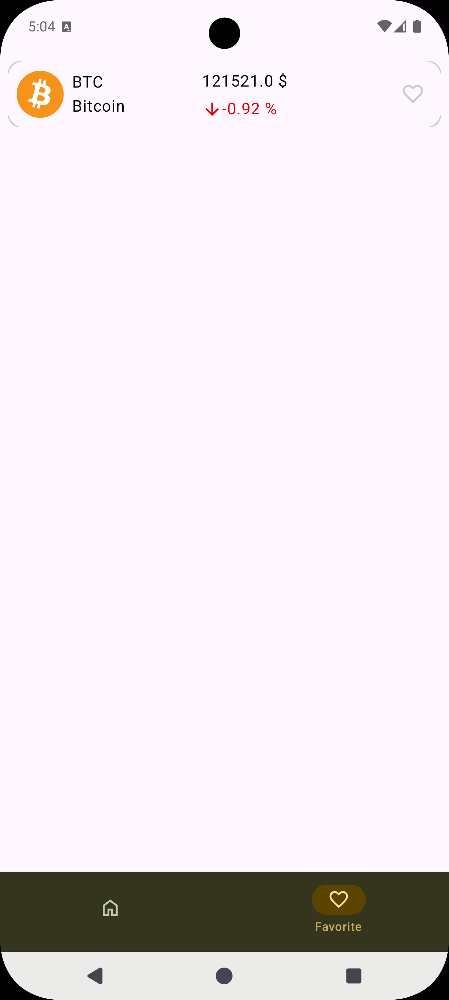
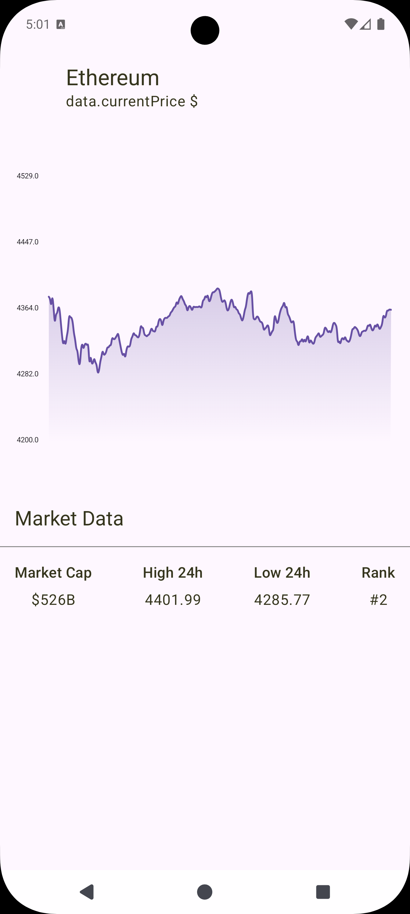

# Welcome to Coin News!
<div align="center">
  <image height= "300" width ="300" src="asset/logo.png"/></image>
  <br>
  <strong>Coin News</strong>
</div>
<br>


[](https://github.com/RahimMahmoudzadeh/CoinNews/issues)
<a href="https://android-arsenal.com/api?level=28"></a>


## 📜 Description
This repository is a sample code for how to use Decompose in Android project.

## 🛠 Built With
|  Architecture Pattern  |Decompose in Presentation Layer|
|----------------   |------------------------------    |
|     UI Framework  | [Jetpack Compose](https://www.jetbrains.com/lp/compose-multiplatform/)         |                        |
| 💉 DI                | [Koin](https://insert-koin.io/)                        |             |
| :floppy_disk: Local Database      | [Room Database](https://developer.android.com/topic/libraries/architecture/room)                   |
| :compass: Navigation       | [Decompose](https://arkivanov.github.io/Decompose/) |
| :thread: Asynchronous Work     | [Coroutines](https://kotlinlang.org/docs/reference/coroutines-overview.html)|
<br>

## :iphone: Screenshots
<table style="width:100%">
  <tr>
    <th>Home Screen</th>
    <th>Favorite Screen</th>
    <th>Detail Screen</th>
  </tr>
  <tr>
    <td></td>
    <td></td>
    <td></td>
  </tr>
</table>
<br>


## 🤝 Contribution
Please read [CONTRIBUTING.md](CONTRIBUTING.md) for details on our code of conduct, and the process for submitting pull requests to us.

## License

```
MIT License

Copyright (c) 2025 Rahim Mahmoudzadeh

Permission is hereby granted, free of charge, to any person obtaining a copy
of this software and associated documentation files (the "Software"), to deal
in the Software without restriction, including without limitation the rights
to use, copy, modify, merge, publish, distribute, sublicense, and/or sell
copies of the Software, and to permit persons to whom the Software is
furnished to do so, subject to the following conditions:

The above copyright notice and this permission notice shall be included in all
copies or substantial portions of the Software.

THE SOFTWARE IS PROVIDED "AS IS", WITHOUT WARRANTY OF ANY KIND, EXPRESS OR
IMPLIED, INCLUDING BUT NOT LIMITED TO THE WARRANTIES OF MERCHANTABILITY,
FITNESS FOR A PARTICULAR PURPOSE AND NONINFRINGEMENT. IN NO EVENT SHALL THE
AUTHORS OR COPYRIGHT HOLDERS BE LIABLE FOR ANY CLAIM, DAMAGES OR OTHER
LIABILITY, WHETHER IN AN ACTION OF CONTRACT, TORT OR OTHERWISE, ARISING FROM,
OUT OF OR IN CONNECTION WITH THE SOFTWARE OR THE USE OR OTHER DEALINGS IN THE
SOFTWARE.
```
